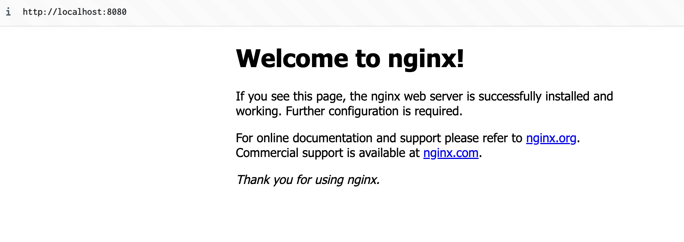

# Commandes Docker

## Liste des commandes de base

### Gestion des images

```
docker images : Liste les images Docker présentes sur la machine
docker pull <image> : Télécharge une image depuis Docker Hub ou un autre registre
docker rmi <image> : Supprime une image
```

### Construction d'images :

```
docker build -t <tag> <path>: Construit une image Docker à partir d'un Dockerfile situé dans le chemin spécifié.
```

### Gestion des conteneurs

```
docker ps : Liste les conteneurs en cours d'exécution
docker ps -a' : Liste tous les conteneurs, même ceux qui ne sont pas en cours d'exécution
docker run <options> <image> : Crée et démarre un nouveau conteneur à partir d'une image
docker start <container> : Démarre un conteneur existant
docker stop <container> : Arrête un conteneur en cours d'exécution
docker restart <container> : Redémarre un conteneur
docker exec -it <container> <command> : Exécute une commande à l'intérieur d'un conteneur en cours d'exécution en mode interactif
```

### Réseaux :

```
docker network ls: Liste les réseaux Docker.
docker network inspect <network>: Affiche des détails sur un réseau spécifique.
```

### Volumes :

```
docker volume ls: Liste les volumes Docker.
docker volume create <name>: Crée un nouveau volume.
docker volume rm <volume>: Supprime un volume Docker.
```

Lorsque je liste mes différentes images, j'observe l'entête du tableau qui liste les différentes informations de mes images (REPOSITORY, TAG, IMAGE ID, CREATED, SIZE). Mais comme je n'en ai aucune, la liste est vide.

### Test Nginx

Dans un premier temps j'ai récupéré l'image de Nginx avec la commande

```
docker pull nginx
```

J'ai ensuite lancé un conteneur avec cette image avec la commande

```
docker run --name test-nginx -d -p 8080:80 nginx
```

Mon conteneur s'appelle "test-nginx", il est sur le port 8080 et il lance l'image "nginx".


