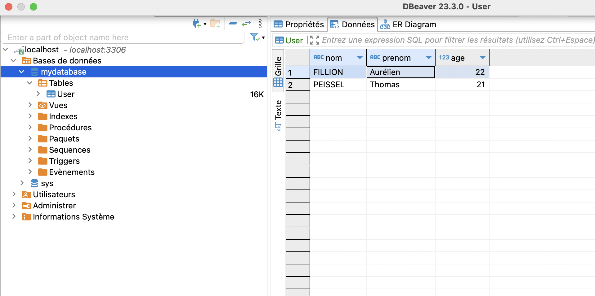
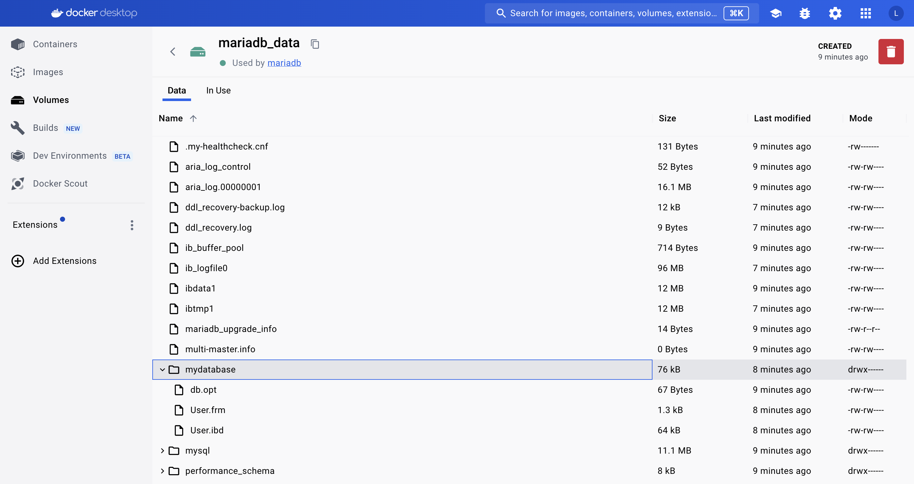

# Volume

## Persistance des données

Lors de la suppression de mon container avec MariaDB, je perds les différentes bdd qui sont dessus. C'est normal puisque je recrée une nouvelle instance de MariaDB.

Cependant il est possible de rendre les donnéess persistantes. Pour cela il faut créer un **volume** qui servira à sauvegarder les données. Ensuite il faut créer un container de MariaDB en précisant le volume à utiliser pour sauvegarder les données.

Pour créer un volume, il faut taper la commande suivante

```
docker volume create mariadb_data
```

Ensuite, lorsque je crée mon container pour MariaDB, je précise le volume avec la balise -v

```
docker run --name mariadb -e MYSQL_ROOT_PASSWORD=mypass -p 3306:3306 -v mariadb_data:/var/lib/mysql -d mariadb
```



Ici nous pouvons voir ma base _mydatabase_ avec une table _User_.



Dans mon volume _mariadb_data_ on peut retrouver ces différentes informations.

Les applications stateful gardent en mémoire des données utilisateur alors que les applications stateless, elles, ne gardent rien.
Pour des traitements différents l'application stateful pourra se servir des données en mémoire alors que la stateless, elle, doit à chaque traitement re-avoir tout le nécessaire.
