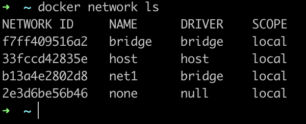

# Réseaux

## Principe

Dans Docker, les réseaux permettent aux conteneurs de communiquer entre eux de manière sécurisée et isolée.

- Réseau par défaut : Lorsque Docker est installé, il crée un réseau par défaut appelé bridge. Les conteneurs connectés à ce réseau peuvent communiquer entre eux, mais le trafic n'est pas routé à l'extérieur du conteneur hôte par défaut. Chaque conteneur reçoit une adresse IP dans le sous-réseau du réseau bridge.

- Réseaux d'extension : Docker propose des réseaux d'extension, tels que host (partageant le réseau de l'hôte) et none (sans réseau). Le réseau host permet au conteneur d'utiliser le réseau de l'hôte, tandis que none isole complètement le conteneur.

- Réseaux personnalisés : Les utilisateurs peuvent créer des réseaux personnalisés pour répondre à des besoins spécifiques. Cela peut inclure la segmentation logique des applications, la connexion à des réseaux externes, etc. Les réseaux personnalisés peuvent être de type bridge, overlay, macvlan, etc.

- Bridge : Les réseaux de type bridge permettent aux conteneurs de communiquer sur le même hôte en utilisant le réseau local bridge. Les conteneurs connectés à un même réseau bridge peuvent se joindre les uns aux autres via leurs noms d'hôte.

- Overlay : Les réseaux overlay permettent de connecter des conteneurs sur différents hôtes. Ils sont utilisés dans des environnements distribués, tels que Docker Swarm et Kubernetes, pour permettre aux conteneurs de communiquer au-delà des limites d'un seul hôte.

- Macvlan : Les réseaux macvlan permettent d'attribuer des adresses IP physiques aux conteneurs, les faisant apparaître comme des dispositifs physiques distincts sur le réseau.

Les réseaux les plus utilisés sont le _bridge_ (celui par défaut) qui permet aux conteneurs de communiquer entre eux sur un même hôte. Le deuxième plus utilisé est Overlay qui permets aux conteneurs de communiquer entre eux sur différents hôtes.

Pour créer mon réseau, je vais utiliser la commande suivante

```
docker network create --driver=bridge net1
```

Cette commande va créer un réseau appelé "net1" en bridge.



Ensuite, lorsque je crée un container (ici nginx), je peux lui précisé d'utiliser ce réseau.

```
docker run -d --name nginx --network net1 nginx:latest
```


Pour inspecter la liste des réseaux

```
docker network ls
```

Pour inspecter les conteneurs liés à un réseau

```
docker inspect <nom du réseau>
```
